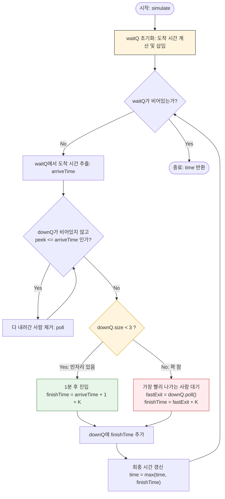

# SWEA 2383: 점심 식사시간 풀이 정리

## 문제 조건 분석

계단을 내려가는 시뮬레이션에서 가장 중요한 규칙들을 정리합니다.

### 계단 입구까지의 이동 시간

사람($P$)에서 계단 입구($S$)까지 가는 시간은 **맨해튼 거리**로 계산합니다.

- $이동 시간 = | PR - SR | + | PC - SC |$

### 계단을 내려가는 규칙

- **대기 시간:** 계단 입구에 도착한 후 **1분 뒤**부터 계단에 진입할 수 있습니다.
- **동시 수용 인원:** 한 계단에는 **최대 3명**만 동시에 존재할 수 있습니다.
- **소요 시간:** 계단 길이 $K$만큼 시간이 지나야 완전히 내려갑니다.
- **대기 상황:** 계단이 꽉 찼다면, 가장 먼저 나가는 사람이 생길 때까지 입구에서 대기합니다.

---

## 알고리즘 접근

1. **부분집합 (Subset):** 계단이 2개뿐이므로, 각 사람이 어떤 계단을 이용할지 모든 경우의 수를 구합니다 $(2^{10} = 1,024)$
2. **시뮬레이션:** 각 경우마다 두 계단에서 모든 사람이 내려가는 데 걸리는 시간을 계산합니다.
3. **우선순위 큐 (PriorityQueue):** `waitQ`: 입구 도착 시간 순 정렬
    - `downQ`: 계단 탈출 시간 순 정렬

---

## 시뮬레이션 로직 (Mermaid)



> **핵심 포인트:**
> 계단이 꽉 찼을 때 `fastExit + stair.num`으로 처리하는 것이 핵심입니다. 이미 입구에서 대기 중이던 상태이므로, 앞사람이 나가자마자 바로 진입하여 1분의 추가 대기 시간 없이 계단 길이만큼만 더해줍니다.

---

## 전체 코드 (Java)

```java
import java.io.*;
import java.util.*;

class Person {
    int y, x;
    public Person(int y, int x) { this.y = y; this.x = x; }
}

class Stair {
    int y, x, num;
    public Stair(int y, int x, int num) { this.y = y; this.x = x; this.num = num; }
}

public class Solution {
    static List<Person> persons;
    static List<Stair> stairs;
    static int minTime;
    static boolean[] checked;

    public static void main(String[] args) throws IOException {
        BufferedReader br = new BufferedReader(new InputStreamReader(System.in));
        int T = Integer.parseInt(br.readLine());
        
        for (int tc = 1; tc <= T; tc++) {
            persons = new ArrayList<>();
            stairs = new ArrayList<>();
            minTime = Integer.MAX_VALUE;
            
            int N = Integer.parseInt(br.readLine());
            for (int i = 0; i < N; i++) {
                StringTokenizer st = new StringTokenizer(br.readLine(), " ");
                for (int j = 0; j < N; j++) {
                    int num = Integer.parseInt(st.nextToken());
                    if (num == 1) persons.add(new Person(i, j));
                    else if (num > 1) stairs.add(new Stair(i, j, num));
                }
            }
            checked = new boolean[persons.size()];
            subs(0);
            System.out.println("#" + tc + " " + minTime);
        }
    }

    static void subs(int index) {
        if (index == persons.size()) {
            List<Person> list1 = new ArrayList<>();
            List<Person> list2 = new ArrayList<>();

            for (int i = 0; i < checked.length; i++) {
                if (checked[i]) list1.add(persons.get(i));
                else list2.add(persons.get(i));
            }

            int time1 = simulate(list1, stairs.get(0));
            int time2 = simulate(list2, stairs.get(1));

            minTime = Math.min(minTime, Math.max(time1, time2));
            return;
        }

        checked[index] = true;
        subs(index + 1);
        checked[index] = false;
        subs(index + 1);
    }

    static int simulate(List<Person> list, Stair stair) {
        PriorityQueue<Integer> waitQ = new PriorityQueue<>();
        PriorityQueue<Integer> downQ = new PriorityQueue<>();

        for (Person p : list)
            waitQ.offer(Math.abs(p.x - stair.x) + Math.abs(p.y - stair.y));

        int time = 0;
        while (!waitQ.isEmpty()) {
            int arriveTime = waitQ.poll();
            
            while (!downQ.isEmpty() && downQ.peek() <= arriveTime) {
                downQ.poll();
            }

            if (downQ.size() < 3) {
                int finishTime = arriveTime + 1 + stair.num;
                downQ.offer(finishTime);
                time = Math.max(time, finishTime);
            } else {
                int fastExit = downQ.poll();
                int finishTime = fastExit + stair.num;
                downQ.offer(finishTime);
                time = Math.max(time, finishTime);
            }
        }
        return time;
    }
}
```
