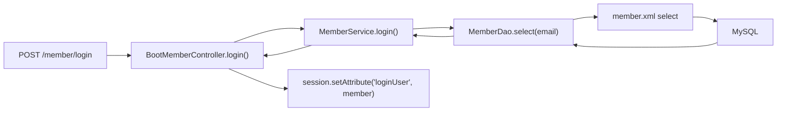

# 설정 한 줄이 끝이 아니었다

이 실습에서 가장 먼저 눈에 들어온 코드는 `application.properties`였다.

```properties
spring.datasource.driver-class-name=com.mysql.cj.jdbc.Driver
spring.datasource.url=jdbc:mysql://localhost:3306/ssafylive?serverTimezone=UTC
spring.datasource.username=${DB_USERNAME}
spring.datasource.password=${DB_PASSWORD}

mybatis.type-aliases-package=com.ssafy.live.*.dto
mybatis.mapper-locations=classpath:mappers/*.xml
```

겉으로 보면 단순하다.
DB 연결 정보를 적고, MyBatis가 DTO와 Mapper XML을 찾을 위치를 알려주면 끝나 보인다.

> 예제에서도 계정 정보는 직접 저장하지 않고 환경 변수로 주입한다. 실습용 계정이라도 저장소에 평문 비밀번호를 남기는 습관은 피하는 편이 안전하다.

그런데 실제로는 여기서부터 여러 계층이 이어진다.

```text
Controller
  -> Service
    -> Mapper Interface
      -> Mapper XML
        -> SQL
          -> MySQL
```

이번 글은 `FW_08_mybatis_lab` 실습 프로젝트를 읽으면서, Spring Boot 안에서 MyBatis가 어떤 식으로 붙고, 어디서 편해지고, 어디서 여전히 SQL을 직접 책임져야 하는지 정리한 기록이다.

---

# 1. 의존성부터 MyBatis용으로 바뀐다

`pom.xml`에는 MyBatis Starter가 추가되어 있다.

```xml
<dependency>
    <groupId>org.mybatis.spring.boot</groupId>
    <artifactId>mybatis-spring-boot-starter</artifactId>
    <version>3.0.5</version>
</dependency>
<dependency>
    <groupId>org.mybatis.spring.boot</groupId>
    <artifactId>mybatis-spring-boot-starter-test</artifactId>
    <version>3.0.5</version>
</dependency>
```

이 지점에서 바로 체감되는 차이는 두 가지다.

1. DAO 구현체를 직접 만들지 않아도 된다.
2. 테스트에서도 MyBatis 환경을 Spring Boot와 함께 올릴 수 있다.

JDBC를 직접 다루던 때에는 `Connection`, `PreparedStatement`, `ResultSet`, 예외 처리, 자원 반납이 코드 곳곳에 들어왔다.
그런데 MyBatis를 붙이면 적어도 DAO 계층의 역할은 훨씬 선명해진다.

---

# 2. DAO는 구현 클래스 대신 인터페이스만 남는다

`MemberDao`는 구현체가 없는 인터페이스다.

```java
@Mapper
public interface MemberDao {
    int insert(Member member);
    int update(Member member);
    int delete(int mno);
    int updateProfile(String email, byte[] profile);
    Member select(String email);
    List<Member> searchAll();
    Member selectDetail(String email);
    int getTotalCount(SearchCondition condition);
    List<Member> search(SearchCondition condition);
}
```

여기서 핵심은 `@Mapper`다.
Spring Boot와 MyBatis가 이 인터페이스를 보고 프록시 객체를 만들어 준다.

즉, 서비스 계층에서는 이렇게 쓸 수 있다.

```java
@Service
@RequiredArgsConstructor
public class BasicMemberService implements MemberService {
    private final MemberDao mDao;
    private final AddressDao aDao;
}
```

예전처럼 `new MemberDaoImpl()` 같은 코드는 보이지 않는다.
대신 인터페이스 메서드와 XML의 SQL이 짝을 맞추는 방식으로 동작한다.

---

# 3. 진짜 일은 Mapper XML에서 벌어진다

`member.xml`을 보면 MyBatis의 분위기가 바로 드러난다.

```xml
<mapper namespace="com.ssafy.live.model.dao.MemberDao">
    <insert id="insert" parameterType="Member" useGeneratedKeys="true" keyProperty="mno">
        insert into member(email,name,password)
        values(#{email},#{name},#{password})
    </insert>

    <select id="select" resultType="Member">
        select * from member where email=#{email}
    </select>
</mapper>
```

이 조합이 의미하는 바는 명확하다.

* `namespace`는 DAO 인터페이스의 전체 경로와 맞아야 한다.
* `id`는 인터페이스의 메서드명과 맞아야 한다.
* `#{}`는 안전한 파라미터 바인딩이다.
* `useGeneratedKeys="true"`는 DB가 만든 기본 키를 DTO에 다시 채워준다.

특히 `insert()` 후에 `member.getMno()`를 바로 쓸 수 있다는 점이 편하다.
실습 코드에서도 이런 방식으로 회원 생성 후 후속 동작을 이어갈 수 있다.

---

# 4. 서비스 계층은 JDBC보다 훨씬 읽기 좋아진다

회원 등록과 로그인 로직은 아래처럼 정리되어 있다.

```java
@Override
public int registMember(Member member) {
    int result = mDao.insert(member);
    return result;
}

@Override
public Member login(String email, String password) {
    Member member = mDao.select(email);
    if (member != null && member.getPassword().equals(password)) {
        return member;
    } else {
        throw new RecordNotFoundException("id/pass 확인");
    }
}
```

이 코드를 보면 MyBatis의 장점이 꽤 분명하다.

서비스는 이제 비즈니스 로직에 더 가까워진다.
회원을 조회하고, 비밀번호를 비교하고, 예외를 던지는 흐름이 그대로 보인다.

반대로 SQL 작성 책임이 사라진 것은 아니다.
그 책임이 Java 구현체에서 XML로 이동했을 뿐이다.
그래서 MyBatis는 "SQL을 숨기는 기술"이라기보다 "SQL을 분리하는 기술"에 가깝다고 느꼈다.

---

# 5. `resultMap`을 쓰기 시작하면 단순 CRUD를 넘어서게 된다

이 실습에서 재미있는 부분은 `selectDetail()`이다.

```xml
<select id="selectDetail" resultMap="memberAddressMap">
    select m.*, a.*
    from member m left join address a using(mno)
    where email = #{email}
</select>

<resultMap id="memberMap" type="Member" autoMapping="true">
    <id column="mno" property="mno"/>
</resultMap>

<resultMap id="memberAddressMap" type="Member" extends="memberMap" autoMapping="true">
    <collection property="addresses" column="mno"
                resultMap="com.ssafy.live.model.dao.AddressDao.addressMap"
                ofType="address" notNullColumn="ano"/>
</resultMap>
```

회원 한 명을 조회하는데 주소 목록까지 함께 매핑한다.
즉, 단순히 "한 줄을 객체 하나로 바꾸는 작업"이 아니라 조인 결과를 객체 그래프로 묶는 단계로 넘어간다.

이 부분을 보고 느낀 건 두 가지다.

1. MyBatis는 JPA처럼 엔티티 관계를 자동 추적하지 않는다.
2. 대신 내가 원하는 조회 형태를 SQL로 정확하게 적고, 매핑도 내가 통제할 수 있다.

자동화는 덜하지만 예측 가능성은 높다.
어떤 쿼리가 나가는지 보인다는 점이 장점이다.

---

# 6. 동적 SQL은 편하지만, 더 신중해져야 한다

실습에는 검색과 조건 조합을 위한 동적 쿼리도 들어 있다.

```xml
<sql id="searchCondition">
    <where>
        <if test="key=='name' and word!=null">
            name like concat('%',#{word},'%')
        </if>
        <if test="key=='email' and word!=null">
            name like concat('%',#{word},'%')
        </if>
    </where>
</sql>
```

그리고 `SearchCondition`은 페이징 계산을 담당한다.

```java
public int getOffset() {
    return (currentPage - 1) * itemsPerPage;
}

public boolean hasKeyword() {
    return normalizedKey() != null && word != null && !word.isBlank();
}
```

이 구조는 꽤 실전적이다.
검색 조건과 페이지 정보를 DTO 하나로 모으고, SQL에서는 `<if>`, `<where>`, `<include>`로 필요한 조각만 붙인다.

특히 MyBatis는 이런 화면형 조회에서 강하다.
게시판, 회원 목록, 검색 결과처럼 "조건에 따라 SQL이 조금씩 달라지는" 화면을 만들 때 생산성이 좋다.

다만 동적 SQL은 편한 만큼 주의도 필요하다.
조건 분기 하나만 잘못 써도 전혀 다른 컬럼을 검색하거나, 빈 조건으로 전체 조회가 나갈 수 있다.
MyBatis를 쓸수록 Java 코드보다 SQL 리뷰가 더 중요해진다는 말을 실감하게 된다.

---

# 7. 트랜잭션은 MyBatis의 기능이 아니라 Spring의 힘으로 묶인다

이 실습에서 가장 좋았던 부분은 "MyBatis 사용법"에서 끝나지 않고 트랜잭션 전파까지 연결했다는 점이다.

먼저 `BasicMemberService.delete()`를 보자.

```java
@Override
@Transactional
public void delete(int mno) {
    aDao.deleteByMno(mno);
    int i = 1/0;
    mDao.delete(mno);
}
```

주소를 먼저 지우고, 일부러 예외를 발생시킨다.
이 메서드가 `@Transactional`로 묶여 있으므로 중간에 실패하면 전체 작업이 롤백되어야 한다.

그리고 별도 서비스에서는 전파 속성을 바꿔가며 차이를 확인한다.

```java
@Override
@Transactional(propagation = Propagation.REQUIRED)
public void required(int mod) {
    int i = 1 / mod;
}

@Override
@Transactional(propagation = Propagation.REQUIRES_NEW)
public void requiresNew(int mod) {
    int i = 1 / mod;
}

@Override
@Transactional(propagation = Propagation.NESTED)
public void nested(int mod) {
    int i = 1 / mod;
}
```

테스트도 의도가 분명하다.

```java
@Test
@DisplayName("비정상적인 경우: REQUIRED - rollback")
public void propagationTest1() {
    Assertions.assertThrows(UnexpectedRollbackException.class,
            () -> txService.start(Propagation.REQUIRED, 0, member.getMno()));
    Member selected = mDao.select(member.getEmail());
    Assertions.assertNotNull(selected);
}
```

이 부분에서 중요한 건, 트랜잭션 경계는 MyBatis XML이 아니라 Spring 서비스 메서드에 있다는 점이다.
MyBatis는 SQL 실행을 맡고, 여러 SQL을 하나의 작업 단위로 묶는 책임은 Spring이 맡는다.

정리하면 역할 분담은 이렇게 이해하면 편하다.

```text
MyBatis: SQL 작성과 매핑
Spring: 트랜잭션, DI, 웹 요청 흐름
```

---

# 8. 컨트롤러까지 보면 MVC 흐름이 한 번에 연결된다

회원 로그인 컨트롤러는 아주 전형적인 MVC 패턴이다.

```java
@PostMapping("/login")
private String login(@RequestParam String email, @RequestParam String password,
        HttpSession session, HttpServletResponse response,
        Model model) {
    try {
        Member member = mService.login(email, password);
        session.setAttribute("loginUser", member);
        return "redirect:/";
    } catch (RecordNotFoundException | DataAccessException e) {
        model.addAttribute("alertMsg", e.getMessage());
        return "member/login-form";
    }
}
```

여기서 요청 하나가 실제로 지나가는 길은 이렇다.



실습 프로젝트를 처음 읽는 사람이라면 이 흐름도 하나만 머릿속에 잡혀도 전체 구조가 훨씬 덜 복잡하게 느껴질 것이다.

---

# 마무리

이번 실습을 보면서 가장 크게 느낀 건 MyBatis가 JDBC의 번거로움을 줄여주지만, SQL 자체를 대신 생각해주지는 않는다는 점이었다.
오히려 SQL을 더 또렷하게 드러내기 때문에, 쿼리의 의도와 매핑 구조를 정확히 이해하는 습관이 더 중요해진다.

개인적으로는 아래 세 가지가 특히 좋았다.

1. `@Mapper` 인터페이스와 XML을 연결하는 구조가 단순하다.
2. `resultMap`으로 조인 결과를 객체 구조에 맞춰 제어할 수 있다.
3. `@Transactional`과 테스트 코드로 서비스 레벨의 롤백 동작까지 검증할 수 있다.

Spring Boot에서 MyBatis를 처음 붙여보는 단계라면, 이 프로젝트는 "설정만 해본 상태"에서 한 걸음 더 나아가 실제 CRUD, 동적 SQL, 트랜잭션까지 한 번에 감을 잡기에 괜찮은 실습이라고 느꼈다.
