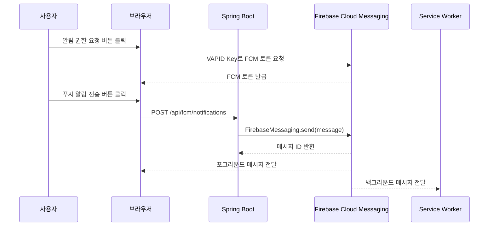
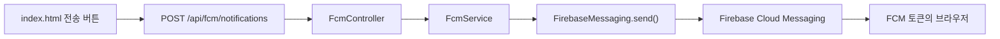

# 버튼 한 번으로 웹 푸시 알림을 보내기까지

이번 실습의 목표는 단순했다.

브라우저에서 알림 권한을 허용하고 FCM 토큰을 발급받은 뒤, Spring Boot 서버를 거쳐 같은 브라우저로 푸시 알림을 보내는 것이다.

화면에서는 버튼 두 개만 누르면 된다.

1. `알림 권한 요청 + 토큰 발급`
2. `푸시 알림 전송`

하지만 실제로는 브라우저, Spring Boot, Firebase Cloud Messaging 사이에 여러 단계가 이어진다.

```text
브라우저
  -> 알림 권한 요청
  -> Service Worker 등록
  -> FCM 토큰 발급
  -> Spring Boot REST API 호출
  -> Firebase Admin SDK로 메시지 전송
  -> 브라우저에서 메시지 수신
```

이번 글은 `SimpleFCM` 실습 프로젝트를 만들면서 FCM 웹 푸시가 어떤 구조로 동작하고, Spring Boot에서는 무엇을 담당해야 하는지 정리한 기록이다.

---

# 1. FCM은 서버와 브라우저 사이에서 메시지를 전달한다

FCM은 Firebase Cloud Messaging의 약자다.
서버가 특정 기기로 푸시 메시지를 보낼 수 있도록 중간에서 메시지 전달을 담당한다.

웹 푸시 실습에서 각 구성 요소의 역할은 다음과 같다.

```text
브라우저: 알림 권한 요청, 토큰 발급, 메시지 표시
Spring Boot: 전송 요청 검증, 메시지 생성, Firebase 호출
Firebase: 토큰에 해당하는 브라우저로 메시지 전달
Service Worker: 브라우저가 백그라운드일 때 메시지 처리
```

전체 요청 흐름을 그림으로 표현하면 아래와 같다.



여기서 가장 중요한 값은 FCM 토큰이다.
서버는 이 토큰을 목적지 주소처럼 사용해 특정 브라우저에 메시지를 보낸다.

---

# 2. Firebase Admin SDK 의존성을 추가한다

Spring Boot 서버가 Firebase로 메시지를 보내려면 Firebase Admin SDK가 필요하다.

`build.gradle`에는 다음 의존성을 추가했다.

```gradle
dependencies {
    implementation 'org.springframework.boot:spring-boot-starter-web'
    implementation 'com.google.firebase:firebase-admin:9.4.3'
}
```

브라우저에서 사용하는 Firebase JavaScript SDK와 서버에서 사용하는 Firebase Admin SDK는 역할이 다르다.

* Firebase JavaScript SDK는 브라우저의 FCM 토큰을 발급하고 메시지를 수신한다.
* Firebase Admin SDK는 서버 권한으로 FCM 메시지를 전송한다.

즉, 클라이언트 SDK만으로는 이번 실습의 전체 흐름을 만들 수 없다.
Spring Boot 서버가 Firebase에 인증할 수 있도록 별도의 서비스 계정도 필요하다.

---

# 3. 서비스 계정으로 Firebase Admin SDK를 초기화한다

Firebase Console에서 서비스 계정 키를 발급받으면 JSON 파일을 내려받을 수 있다.
실습에서는 해당 파일의 위치를 `application.properties`에 지정했다.

```properties
firebase.service-account.path=/firebase/firebase-service-account.json
```

그리고 `FirebaseConfig`에서 서비스 계정 파일을 읽어 `FirebaseApp`과 `FirebaseMessaging` 빈을 생성한다.

```java
@Configuration
@Slf4j
public class FirebaseConfig {
    @Value("${firebase.service-account.path}")
    private String serviceAccountPath;

    @Bean
    public FirebaseApp firebaseApp() throws IOException {
        FirebaseOptions options = FirebaseOptions.builder()
                .setCredentials(
                        GoogleCredentials.fromStream(
                                new ClassPathResource(serviceAccountPath).getInputStream()
                        )
                )
                .build();

        return FirebaseApp.initializeApp(options);
    }

    @Bean
    public FirebaseMessaging firebaseMessaging(FirebaseApp firebaseApp) {
        return FirebaseMessaging.getInstance(firebaseApp);
    }
}
```

이 설정 덕분에 서비스에서는 `FirebaseMessaging`을 생성하는 과정을 반복하지 않고 주입받아 사용할 수 있다.

```text
서비스 계정 JSON
  -> GoogleCredentials
    -> FirebaseOptions
      -> FirebaseApp
        -> FirebaseMessaging
```

서비스 계정 JSON에는 Firebase 프로젝트를 제어할 수 있는 비밀 키가 들어 있다.
따라서 실제 프로젝트에서는 이 파일을 Git에 커밋하면 안 된다.

```gitignore
src/main/resources/firebase/firebase-service-account.json
```

배포 환경에서는 파일을 프로젝트 안에 포함하는 방식보다 환경 변수나 Secret Manager 같은 비밀 관리 도구를 사용하는 편이 안전하다.

---

# 4. FcmService는 메시지를 만들고 전송한다

실제 메시지 전송은 `FcmService`가 담당한다.

```java
@Service
@RequiredArgsConstructor
@Slf4j
public class FcmService {
    private final FirebaseMessaging firebaseMessaging;

    public String sendNotification(
            String title,
            String body,
            String fcmToken
    ) throws FirebaseMessagingException {
        Message message = Message.builder()
                .putData("title", title)
                .putData("body", body)
                .setToken(fcmToken)
                .build();

        String response = firebaseMessaging.send(message);
        log.info("Successfully sent Notification: {}", response);
        return response;
    }
}
```

`Message.builder()`에서 확인할 부분은 두 가지다.

1. `putData()`로 제목과 내용을 데이터 메시지에 담는다.
2. `setToken()`으로 메시지를 받을 브라우저를 지정한다.

전송에 성공하면 `firebaseMessaging.send()`는 Firebase가 발급한 메시지 ID를 반환한다.
반대로 토큰이 만료되었거나 Firebase 인증에 문제가 있으면 `FirebaseMessagingException`이 발생한다.

처음에는 서비스 내부에서 예외를 잡고 로그만 남기는 방식도 생각할 수 있다.
하지만 그렇게 하면 컨트롤러는 실제 전송 성공 여부를 알 수 없다.

그래서 이번 실습에서는 서비스가 메시지 ID를 반환하고, 실패 예외는 컨트롤러까지 전달하도록 구성했다.

---

# 5. RestController는 브라우저와 FcmService를 연결한다

브라우저가 직접 Firebase Admin SDK를 호출할 수는 없다.
대신 Spring Boot의 REST API에 제목, 내용, FCM 토큰을 전달한다.

```java
@RestController
@RequestMapping("/api/fcm")
@RequiredArgsConstructor
public class FcmController {
    private final FcmService fcmService;

    @PostMapping("/notifications")
    public ResponseEntity<SendNotificationResponse> sendNotification(
            @RequestBody SendNotificationRequest request
    ) {
        if (isBlank(request.title())
                || isBlank(request.body())
                || isBlank(request.fcmToken())) {
            return ResponseEntity.badRequest()
                    .body(new SendNotificationResponse(
                            false,
                            null,
                            "제목, 내용, FCM 토큰을 모두 입력해주세요."
                    ));
        }

        try {
            String messageId = fcmService.sendNotification(
                    request.title(),
                    request.body(),
                    request.fcmToken()
            );

            return ResponseEntity.ok(new SendNotificationResponse(
                    true,
                    messageId,
                    "푸시 알림 전송에 성공했습니다."
            ));
        } catch (FirebaseMessagingException exception) {
            return ResponseEntity.status(HttpStatus.BAD_GATEWAY)
                    .body(new SendNotificationResponse(
                            false,
                            null,
                            "FCM 푸시 알림 전송에 실패했습니다."
                    ));
        }
    }

    private boolean isBlank(String value) {
        return value == null || value.isBlank();
    }

    public record SendNotificationRequest(
            String title,
            String body,
            String fcmToken
    ) {
    }

    public record SendNotificationResponse(
            boolean success,
            String messageId,
            String message
    ) {
    }
}
```

API 요청 형식은 다음과 같다.

```http
POST /api/fcm/notifications
Content-Type: application/json
```

```json
{
  "title": "FCM 테스트 알림",
  "body": "푸시 알림이 정상적으로 도착했습니다.",
  "fcmToken": "브라우저에서 발급받은 FCM 토큰"
}
```

컨트롤러는 빈 값이 들어오면 `400 Bad Request`를 반환한다.
Firebase 전송 과정에서 실패하면 외부 서비스 호출 실패라는 의미로 `502 Bad Gateway`를 반환한다.

작은 실습이지만, 성공과 실패를 HTTP 응답으로 구분해 두면 프론트엔드에서 결과를 처리하기 편해진다.

---

# 6. 브라우저에서는 알림 권한과 FCM 토큰이 먼저 필요하다

웹 푸시는 사용자의 허락 없이 표시할 수 없다.
따라서 가장 먼저 브라우저의 알림 권한을 요청해야 한다.

```javascript
const permission = await Notification.requestPermission();

if (permission !== "granted") {
    alert("알림 권한이 거부되었습니다.");
    return;
}
```

권한을 얻은 뒤에는 Service Worker를 등록하고 FCM 토큰을 발급받는다.

```javascript
const registration = await navigator.serviceWorker.register(
    "/firebase-messaging-sw.js"
);

const fcmToken = await getToken(messaging, {
    vapidKey: "YOUR_PUBLIC_VAPID_KEY",
    serviceWorkerRegistration: registration
});
```

VAPID Key는 Firebase Console의 웹 푸시 인증서 설정에서 확인할 수 있다.
이 키는 브라우저가 웹 푸시 구독을 만들 때 사용한다.

Firebase 웹 설정도 필요하다.
공개 글이나 예제 저장소에서는 실제 프로젝트 값을 그대로 적기보다 아래처럼 플레이스홀더를 사용하는 편이 좋다.

```javascript
const firebaseConfig = {
    apiKey: "YOUR_FIREBASE_API_KEY",
    authDomain: "YOUR_PROJECT.firebaseapp.com",
    projectId: "YOUR_PROJECT_ID",
    messagingSenderId: "YOUR_MESSAGING_SENDER_ID",
    appId: "YOUR_APP_ID"
};
```

브라우저에서 사용하는 Firebase 설정값은 서비스 계정 비밀 키와 성격이 다르다.
하지만 Firebase Security Rules와 허용 도메인 설정 없이 공개하면 오용될 수 있으므로 프로젝트 설정도 함께 점검해야 한다.

---

# 7. 전송 버튼은 Spring Boot REST API를 호출한다

FCM 토큰이 발급되면 전송 버튼을 활성화한다.
사용자가 버튼을 누르면 제목, 내용, 토큰을 JSON으로 만들어 Spring Boot 서버로 보낸다.

```javascript
const response = await fetch("/api/fcm/notifications", {
    method: "POST",
    headers: {
        "Content-Type": "application/json"
    },
    body: JSON.stringify({
        title: document.getElementById("title").value,
        body: document.getElementById("body").value,
        fcmToken
    })
});

const result = await response.json();

if (!response.ok) {
    throw new Error(result.message);
}

resultElement.textContent =
        `${result.message}\n메시지 ID: ${result.messageId}`;
```

이 요청이 지나가는 경로는 다음과 같다.



브라우저가 서버에 전송 요청을 보내고, 서버가 다시 같은 브라우저의 토큰으로 메시지를 보내는 구조다.

실제 서비스에서는 사용자가 자기 토큰을 매번 요청 본문에 넣기보다, 로그인 사용자와 FCM 토큰을 DB에 연결해 저장하는 방식이 일반적이다.

---

# 8. 포그라운드와 백그라운드 수신 방식은 다르다

웹 푸시를 구현할 때 가장 헷갈렸던 부분은 브라우저 상태에 따라 메시지 처리 위치가 달라진다는 점이었다.

페이지가 열려 있고 활성화된 포그라운드 상태에서는 `onMessage()`가 메시지를 받는다.

```javascript
onMessage(messaging, (payload) => {
    new Notification(payload.data?.title || "테스트 알림", {
        body: payload.data?.body || "내용 없음"
    });
});
```

반대로 페이지가 백그라운드에 있거나 닫혀 있으면 Service Worker가 메시지를 처리한다.

`firebase-messaging-sw.js`는 다음과 같이 작성했다.

```javascript
importScripts(
    "https://www.gstatic.com/firebasejs/10.13.2/firebase-app-compat.js"
);
importScripts(
    "https://www.gstatic.com/firebasejs/10.13.2/firebase-messaging-compat.js"
);

firebase.initializeApp({
    apiKey: "YOUR_FIREBASE_API_KEY",
    authDomain: "YOUR_PROJECT.firebaseapp.com",
    projectId: "YOUR_PROJECT_ID",
    messagingSenderId: "YOUR_MESSAGING_SENDER_ID",
    appId: "YOUR_APP_ID"
});

const messaging = firebase.messaging();

messaging.onBackgroundMessage((payload) => {
    self.registration.showNotification(
        payload.data?.title || "테스트 알림",
        {
            body: payload.data?.body || "내용 없음"
        }
    );
});
```

이번 서버 코드는 `putData()`를 사용해 데이터 메시지를 보내고 있다.
따라서 브라우저에서도 `payload.notification`이 아니라 `payload.data`에서 제목과 내용을 읽어야 한다.

```text
Message.putData("title", ...)
  -> payload.data.title

Message.putData("body", ...)
  -> payload.data.body
```

서버가 어떤 메시지 형식을 보내는지와 클라이언트가 어느 필드를 읽는지가 맞지 않으면, 알림은 도착해도 제목과 내용이 비어 보일 수 있다.

---

# 9. 컨트롤러 테스트로 REST 응답을 검증한다

FCM 실제 전송은 외부 서비스와 네트워크에 의존한다.
하지만 컨트롤러가 요청을 제대로 검증하고 서비스 결과를 올바른 HTTP 응답으로 변환하는지는 단위 테스트로 확인할 수 있다.

```java
@Test
void sendsNotification() throws Exception {
    when(fcmService.sendNotification("제목", "내용", "token"))
            .thenReturn("message-id");

    mockMvc.perform(post("/api/fcm/notifications")
                    .contentType(MediaType.APPLICATION_JSON)
                    .content("""
                            {
                              "title": "제목",
                              "body": "내용",
                              "fcmToken": "token"
                            }
                            """))
            .andExpect(status().isOk())
            .andExpect(jsonPath("$.success").value(true))
            .andExpect(jsonPath("$.messageId").value("message-id"));
}
```

실습에서는 다음 세 가지 상황을 테스트했다.

1. 정상 요청이면 `200 OK`와 메시지 ID를 반환한다.
2. 제목, 내용, 토큰 중 하나가 비어 있으면 `400 Bad Request`를 반환한다.
3. Firebase 전송이 실패하면 `502 Bad Gateway`를 반환한다.

실제 FCM 도착 여부는 브라우저에서 직접 확인해야 하지만, 서버 API의 분기까지 외부 서비스에 의존할 필요는 없다.

---

# 10. 직접 실행하며 확인한 순서

실습은 아래 순서로 확인하면 된다.

1. Firebase Console에서 웹 앱과 웹 푸시 인증서를 설정한다.
2. 서비스 계정 JSON을 준비하고 Spring Boot 서버를 실행한다.
3. `http://localhost:8080`에 접속한다.
4. `알림 권한 요청 + 토큰 발급` 버튼을 누른다.
5. 브라우저 알림 권한을 허용한다.
6. FCM 토큰이 화면에 표시되는지 확인한다.
7. 제목과 내용을 입력하고 `푸시 알림 전송` 버튼을 누른다.
8. 화면에 메시지 ID가 표시되고 푸시 알림이 도착하는지 확인한다.
9. 다른 탭으로 이동한 뒤 다시 전송해 백그라운드 알림도 확인한다.

웹 푸시는 보안 컨텍스트에서만 동작한다.
개발 환경의 `localhost`는 예외적으로 허용되지만, 실제 배포 환경에서는 HTTPS가 필요하다.

또한 브라우저에서 알림 권한을 한 번 차단하면 버튼을 다시 눌러도 권한 창이 나타나지 않을 수 있다.
이 경우 브라우저의 사이트 설정에서 알림 권한을 직접 변경해야 한다.

---

# 마무리

이번 실습을 통해 FCM 푸시 알림은 서버에서 메시지 하나를 보내는 코드만으로 끝나지 않는다는 점을 확인했다.

서버는 서비스 계정으로 Firebase Admin SDK를 초기화하고, 브라우저는 알림 권한과 Service Worker를 준비해야 한다.
그 사이를 FCM 토큰과 REST API가 연결한다.

개인적으로는 아래 네 가지가 특히 중요했다.

1. FCM 토큰은 메시지를 받을 브라우저를 식별하는 주소 역할을 한다.
2. 서버의 `FirebaseMessaging`은 서비스 계정으로 인증해야 한다.
3. 포그라운드 메시지와 백그라운드 메시지는 처리 위치가 다르다.
4. 데이터 메시지를 보냈다면 클라이언트에서도 `payload.data`를 읽어야 한다.

이번 프로젝트는 특정 브라우저 토큰으로 메시지를 보내는 가장 단순한 형태다.
실제 서비스로 확장하려면 로그인 사용자별 토큰 저장, 여러 기기 관리, 만료 토큰 삭제, 알림 클릭 이동, 전송 이력 관리 같은 기능이 추가로 필요하다.

그래도 브라우저에서 토큰을 발급받고 Spring Boot를 거쳐 다시 푸시 알림을 받는 전체 흐름을 한 번 직접 연결해 본 것만으로도 FCM의 기본 구조를 이해하는 데 도움이 되었다.
