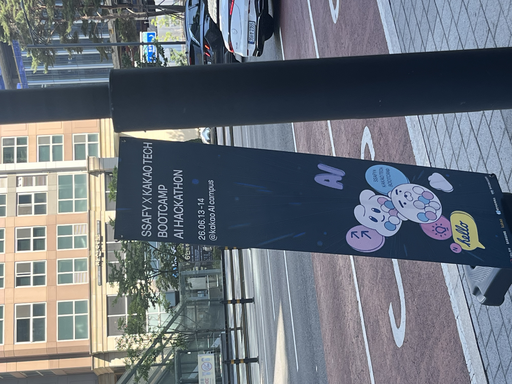
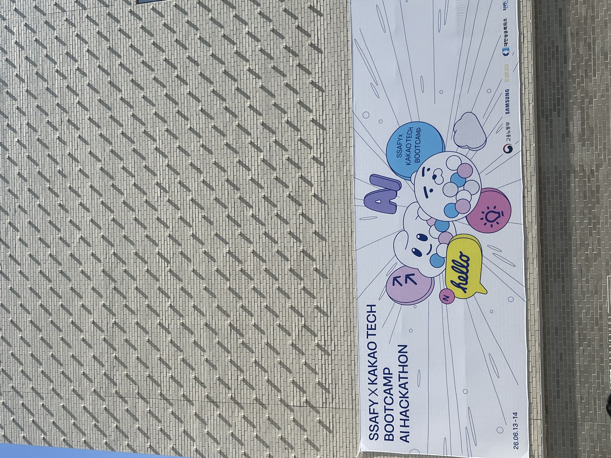
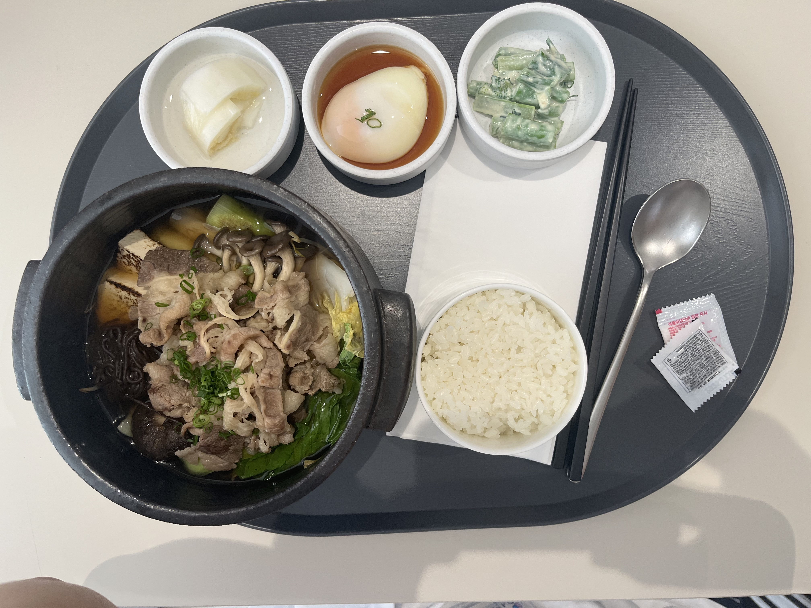
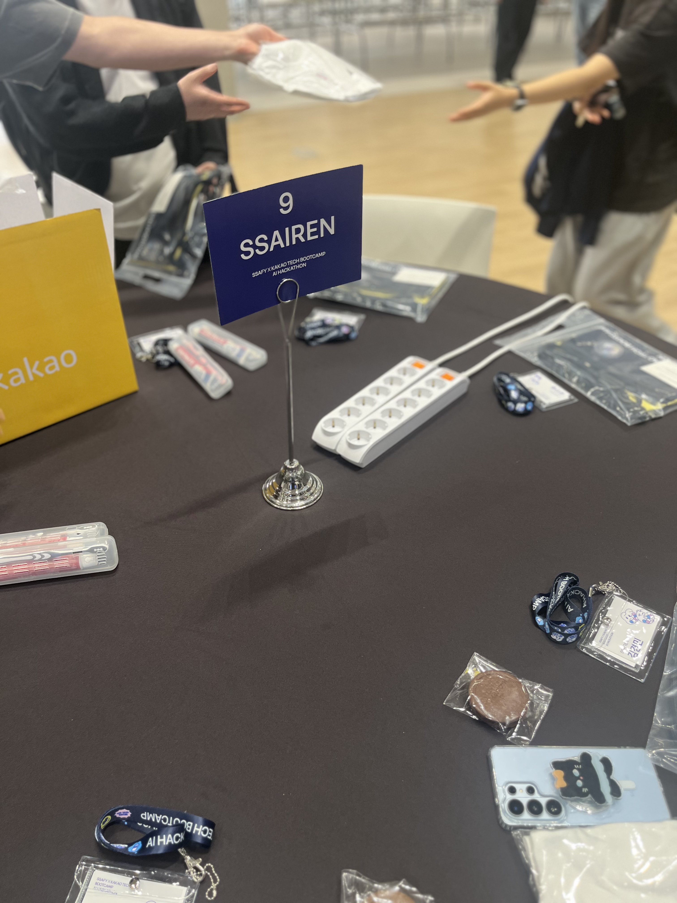
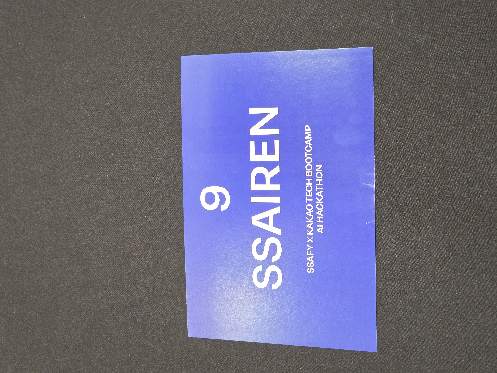
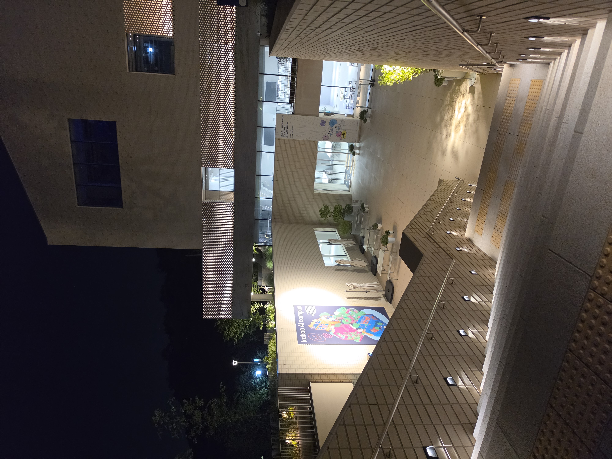

해커톤에 다녀왔습니다. 100개 이상팀이 지원했다는데 운이 좋게 상위 6개팀에 선정되어 용인 카카오 AI캠퍼스에 다녀왔습니다.

# 판교 카카오 본사

판교에 집합해서 셔틀버스를 타고 용인까지 날라갔습니다. 가슴이 웅장해지네요. 역시 카카오는 다르구나

# 용인 AI 캠퍼스

처음 들어올때 싸피랑 카카오 직원분들이 `도열` 해주시는데 기분이 이상했다. 열심히 할께요

간략한 오리엔테이션을 하고 바로 작업에 들어갔다. 밥이 정말 건강하고 맛있게? 잘 나온다. 오래 일하기 위해 직원들의 건강을 잘 챙기는 것 같다.

밥 먹으러 또 올래요
# 해커톤 시작

우리 팀의 주제는  AI 민생 10대 프로젝트의 일환인 `AI 기반 보이스피싱 통신서비스 공동 대응 플랫폼`이다. 어느정도 코드 구현을 해놓고 가서 다행이였던거 같다.
나는 역할을 백엔드 개발자였다. `SpringBoot`로 구현을 진행했다. `DB`는 `PostgreSQL` 사용했다. MVP가 목표라 그냥 `NoSQL`를 고려했는데 초반 기획 단계에서 AI 모델 고도화를 위한  `VectorDB`가 필요할 수 있겠다 판단이 들어 psql를 사용했다.(결국에는 VectorDB 안씀)
# 위기
프로젝트 특성상 `SpringBoot` 서버는 Flutter와 Dashboard 사이에 껴서 `Proxy` 역할을 했는데. 정말 어려웠다. ERD 짜랴, 기능 구현 하랴, 다른 파트원들에게 설명하랴.. 내가 많이 부족했지만 고마웠다. 다른 파트팀과 소통이 잘 안되서 힘들었던 것 같다. 모든 인원들이 같은 플로우를 이해하고, 같은 그림을 보고 있어야하는데 서로 전달이 안되고, 문서도 뒤죽박죽 섞이고 했던 말 계속 반복하고... 힘들었지만 재미있었다.

마감직전에는 졸았다. 이때 좀 팀원들에게 죄송했다. 사진은 처참한 전투 사진
우승 드가자!

# 결말

어림도 없지 예탈해버렸다. 아쉬웠다..... 다른 팀분들은 구현 보다는 발표와 아이디어 구체화에 좀더 힘을 쓴 느낌이였다. (우리 진짜 작동하는데...) 결국 박수치는 인원으로 전락해버렸다.

# 마무리

건물이 진짜 이쁘다. 흡연 중에 카카오 테크 리더분이랑 스물 토크를 했는데. 재미있었다. 처음에는 그냥 직원 분인줄 알고 토크를 하다가 한시간 뒤에 앞에서 강연하시는 모습을 보고 알았다. (담배 빌려드렸는데 나중에 뵙게 되면 달라고 해야지)

거의 30시간을 깨어있으며 고생했던 팀원들에게 감사함을 느끼고 가장 고생한 팀장님에게 존경을 표한다.(계속 인터뷰를 따갔다.) 

오랜만에 내가 왜 개발자를 시작했지 느낀거 같다. 아 나는 이런게 재밌어서 개발을 시작했구나. 사람들이랑 기술에 대해 논의하고 웃고 떠들고 뭔가 `몽글몽글`한 감정? 좋았다. 가슴이 뜨겁다.

## 다음번에는!

문서를 한곳에서만 만들어햐 한다. Mattermost, 카카오톡, discord, notion 다른 플랫폼에 문서들이 작성되어 있어 서로 공유가 어려웠던거 같다. 

